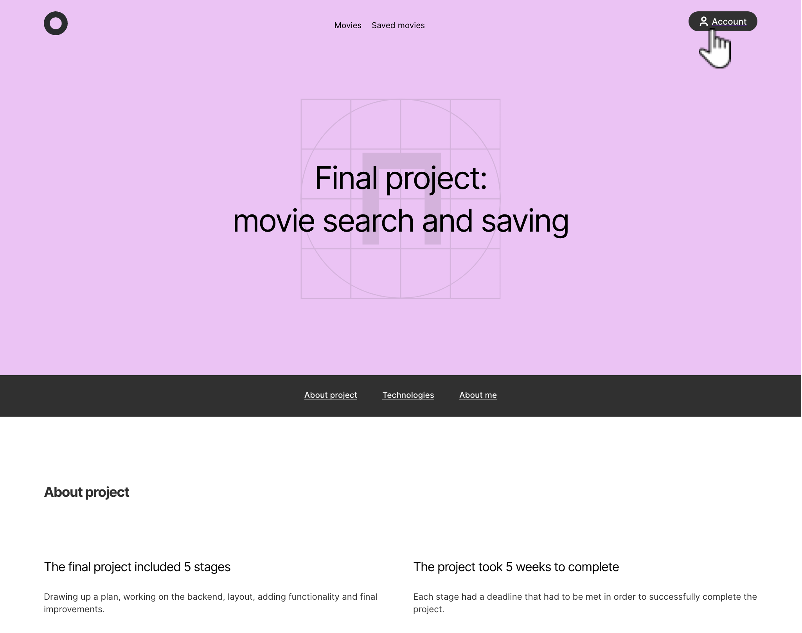
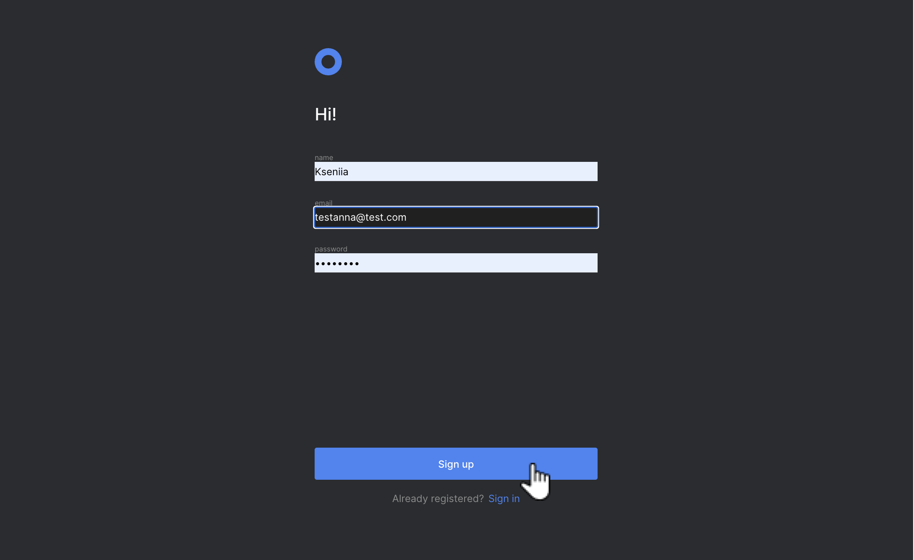
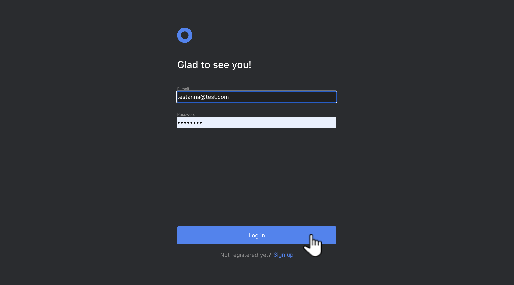
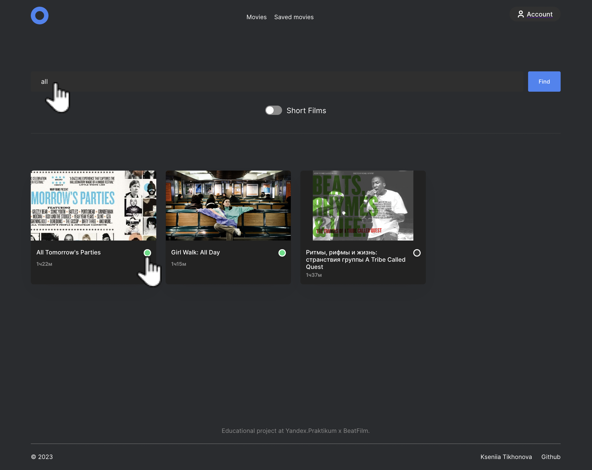
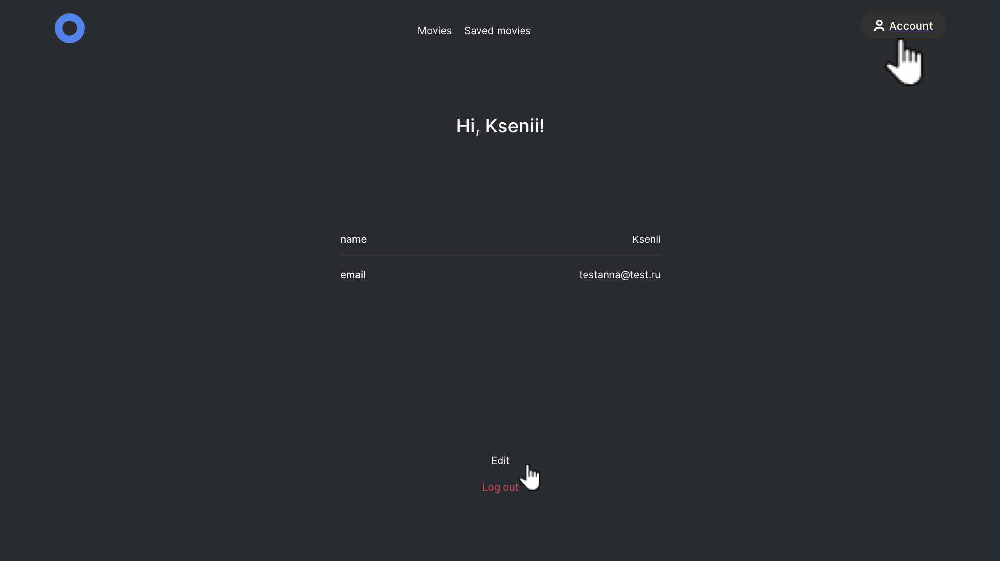
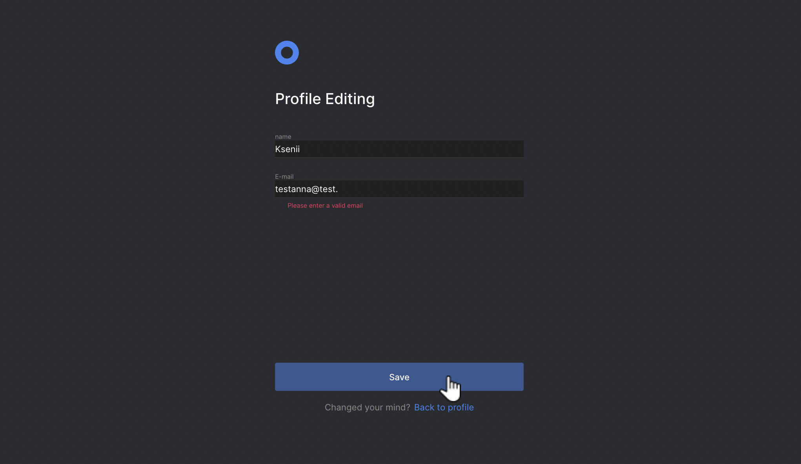

# Study project "movies-explorer-react"
The final project on the web faculty at Yandex.Practicum

***This is a service where you can search for movies on demand and save them in your personal account.***>

## Tools and stack: 
HTML / CSS / React / Express / MongoDB / NodeJS / API / JWT
<br />

## Here's what was done:
* set up infrastructure and created Express server;
* connected database, created API schemas and resource models;
* implemented logging, authentication and authorization on the server;
* the backend was deployed on Yandex Сloud;
* components made up in React, markup was ported to the React format;
* described the logic and layout of registration, login, profile editing, and saved movies pages;
* asynchronous GET- and POST-requests to the API were implemented;
* authorized and unauthorized states, saving movies in the profile were worked out;
* received movies are filtered on the client side.

## Project screenshots:
***Main page***


***Registration page: create your account***


***Login page***


***Movie search page: search for a movie by keyword (use only one letter)***


***Account: Edit your account***



## Project links
### Website
[Visit our website](https://diploma-kseniia.nomoredomainsmonster.ru/)
### Figma Project
[Explore Figma Project](https://www.figma.com/file/LIZzsFoCCZrF381c6XbWSg/Diploma-(Copy)?node-id=891%3A3857&mode=dev)


## Project Setup Instructions
To set up this project locally, follow the steps below:

1. **Clone the Repository:**

    ```bash
    git clone https://github.com/TikhonovaKs/movies-explorer-react.git
    ```

2. **Navigate to the Repository:**

    ```bash
    cd movies-explorer-react
    ```

3. **Navigate to the Frontend Folder:**

    ```bash
    cd frontend
    ```

4. **Install Frontend Dependencies:**

    ```bash
    npm install
    # or
    yarn
    ```

5. **Navigate Back to the Main Repository Folder:**

    ```bash
    cd ..
    ```

6. **Navigate to the API Folder:**

    ```bash
    cd api
    ```

7. **Install API Dependencies:**

    ```bash
    npm install
    # or
    yarn
    ```
    
Now your local setup is complete. You can start working with the frontend and API folders separately.

### Running the Frontend:
To run the frontend, execute the following command within the `frontend` folder:

```bash
npm start
# or
yarn start
